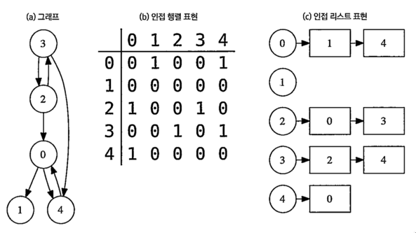
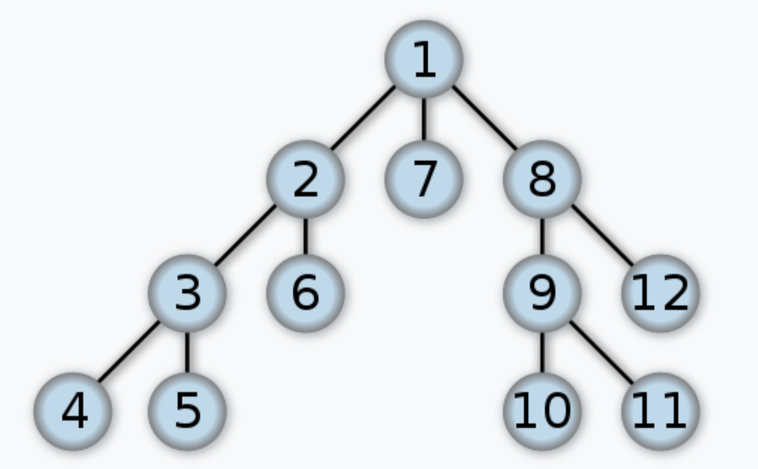

# DFS 란?

- 대표적인 그래프 탐색 알고리즘
- 시작 노드에서 시작해서 다음 분기(branch)로 넘어가기 전에 해당 분기를 완벽하게 탐색하는 방법
- 즉, 특정 노드를 방문했을 때, 그 노드와 연결되어있으며 한 번도 방문하지 않은 모든 노드를 방문한다.

# Graph
- 인접 리스트로 표현하는 경우
- 인접 행렬로 표현하는 경우


# Code
  
이미지 출처: [wikipedia](https://en.wikipedia.org/wiki/Depth-first_search)
```javascript
const adj = [
    [0, 1, 0, 0, 0, 0, 1, 1, 0, 0, 0, 0],
    [1, 0, 1, 0, 0, 1, 0, 0, 0, 0, 0, 0],
    [0, 1, 0, 1, 1, 0, 0, 0, 0, 0, 0, 0],
    [0, 0, 1, 0, 0, 0, 0, 0, 0, 0, 0, 0],
    [0, 0, 1, 0, 0, 0, 0, 0, 0, 0, 0, 0],
    [0, 1, 0, 0, 0, 0, 0, 0, 0, 0, 0, 0],
    [1, 0, 0, 0, 0, 0, 0, 0, 0, 0, 0, 0],
    [1, 0, 0, 0, 0, 0, 0, 0, 1, 0, 0, 1],
    [0, 0, 0, 0, 0, 0, 0, 1, 0, 1, 1, 0],
    [0, 0, 0, 0, 0, 0, 0, 0, 1, 0, 0, 0],
    [0, 0, 0, 0, 0, 0, 0, 0, 1, 0, 0, 0],
    [0, 0, 0, 0, 0, 0, 0, 1, 0, 0, 0, 0]
];

const visited = [false, false, false, false, false, false, false, false, false, false, false, false];

function dfs(n) {
    visited[n] = true;
    console.log(n+1);

    for (let i = 0; i < adj.length; i++) {
        if (adj[n][i] === 1 && !visited[i]) {
            dfs(i);
        }
    }
}

dfs(0);
```
# 팁
코딩테스트에서 특정 depth 를 정해놓고 backtracking 해야하는 문제는 거의 안나온다.  
즉, 모든 경우에 대한 탐색을 해야할 때 dfs 를 사용한다.  
bfs 또한 모든 경우에 대한 탐색이 가능하지만, dfs 가 구현이 간편하다.  
다만, 최단 경로를 구해야 하는 문제에서는 bfs 를 사용해야한다.

isVisited 배열을 구현할 때, 경우에 따라서는 비트마스크를 사용하는 것이 효율적일 때도 있다.  
비트마스크는 코딩 테스트에서는 유용한 자료구조이지만, 실제 업무에서는 memory usage 를 아껴야하는 등의 특수한 상황이 아닌 이상 잘 사용되지 않는다.

# 응용
- [위상정렬](https://reakwon.tistory.com/140)
- 오일러 서킷

# 출처
알고리즘 문제해결 전략2 (구종만)